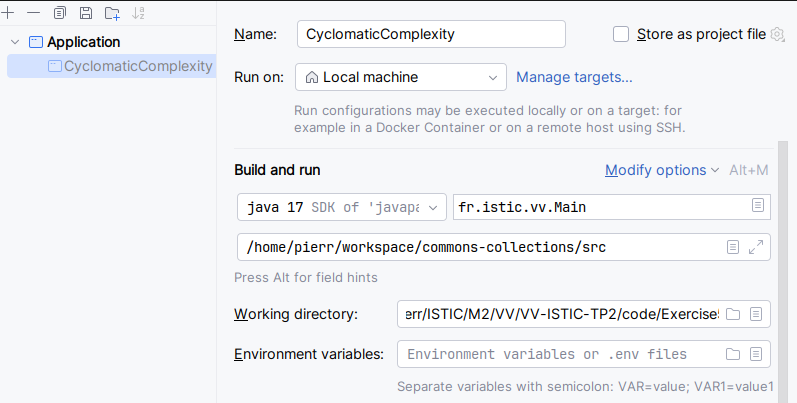

# Code of your exercise

Put here all the code created for this exercise

* Le code du Visiteur java CyclomaticComplexityPrinter :

```java
package fr.istic.vv;

import com.github.javaparser.ast.CompilationUnit;
import com.github.javaparser.ast.body.*;
import com.github.javaparser.ast.expr.BinaryExpr;
import com.github.javaparser.ast.expr.ConditionalExpr;
import com.github.javaparser.ast.stmt.*;
import com.github.javaparser.ast.visitor.VoidVisitorWithDefaults;

import java.util.concurrent.atomic.AtomicInteger;
import java.util.stream.Collectors;

public class CyclomaticComplexityPrinter extends VoidVisitorWithDefaults<Void> {

    private StringBuilder html = new StringBuilder();
    private int currentE = 0;

    @Override
    public void visit(CompilationUnit unit, Void arg) {
        for (TypeDeclaration<?> type : unit.getTypes()) {
            type.accept(this, null);
        }
    }

    @Override
    public void visit(ClassOrInterfaceDeclaration declaration, Void arg) {
        html.append("<h2>").append(declaration.getFullyQualifiedName().orElse("")).append("</h2>\n");
        html.append("<table border='1'>");
        html.append("<tr><th>Method</th><th>Parameters</th><th>Cyclomatic Complexity</th></tr>");
        for (MethodDeclaration method : declaration.getMethods()) {
            method.accept(this, arg);
        }
        html.append("</table>");
    }

    @Override
    public void visit(MethodDeclaration method, Void arg) {
        int cyclomaticComplexity = 1
                + method.getChildNodesByType(IfStmt.class).size()
                + method.getChildNodesByType(ForStmt.class).size()
                + method.getChildNodesByType(WhileStmt.class).size()
                + method.getChildNodesByType(DoStmt.class).size()
                + method.getChildNodesByType(SwitchStmt.class).size()
                + method.getChildNodesByType(ConditionalExpr.class).size()
                + method.getChildNodesByType(BinaryExpr.class).stream().
                filter(f -> f.getOperator() == BinaryExpr.Operator.AND).collect(Collectors.toList()).size()
                + method.getChildNodesByType(BinaryExpr.class).stream().
                filter(f -> f.getOperator() == BinaryExpr.Operator.OR).collect(Collectors.toList()).size();

        html.append("<tr>");
        html.append("<td>").append(method.getName()).append("</td>");
        html.append("<td>").append(
                method.getParameters().stream().map(parameter -> parameter.getTypeAsString() + " " + parameter.getNameAsString()).collect(Collectors.joining(", "))
        ).append("</td>");
        html.append("<td>").append(cyclomaticComplexity).append("</td>");
        html.append("</tr>");
    }

    public String generateHTMLTable() {
        return html.toString();
    }
}
```

* Pour lancer le parser sur _commons-collections_ :
  

* Résultat :
[cyclomatic_complexity_report.html](cyclomatic_complexity_report.html)
