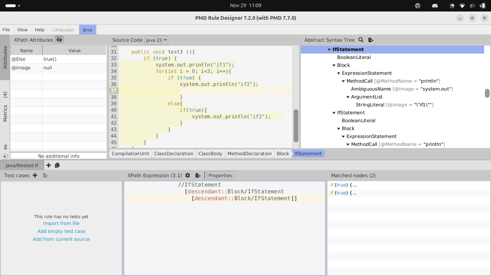

# Extending PMD

Use XPath to define a new rule for PMD to prevent complex code. The rule should detect the use of three or more nested `if` statements in Java programs so it can detect patterns like the following:

```Java
if (...) {
    ...
    if (...) {
        ...
        if (...) {
            ....
        }
    }

}
```
Notice that the nested `if`s may not be direct children of the outer `if`s. They may be written, for example, inside a `for` loop or any other statement.
Write below the XML definition of your rule.

You can find more information on extending PMD in the following link: https://pmd.github.io/latest/pmd_userdocs_extending_writing_rules_intro.html, as well as help for using `pmd-designer` [here](https://github.com/selabs-ur1/VV-ISTIC-TP2/blob/master/exercises/designer-help.md).

Use your rule with different projects and describe you findings below. See the [instructions](../sujet.md) for suggestions on the projects to use.

## Answer

Instruction pour la règle PMD

```
//IfStatement
    [descendant::Block/IfStatement
        [descendant::Block/IfStatement]]
```

J'utilise Bloc/IfStatement plutôt que IfStatement pour eviter la detection des else if succesifs :

```java
if(...){}
else if(){}
```

Dans pmd Designer :



Le rulesets est disponible [ici](../rulesets.xml).

Je l'ai testé dans apache commons collections. Il a trouvé plusieurs erreurs !

exemple de sortie :

```bash
src/main/java/org/apache/commons/collections4/bidimap/TreeBidiMap.java:1361:    Regles_VV_tp2:  too much nested if 
src/main/java/org/apache/commons/collections4/bidimap/TreeBidiMap.java:2107:    Regles_VV_tp2:  too much nested if 
src/main/java/org/apache/commons/collections4/bidimap/TreeBidiMap.java:2132:    Regles_VV_tp2:  too much nested if 
src/main/java/org/apache/commons/collections4/comparators/ComparatorChain.java:205:     Regles_VV_tp2:  too much nested if 
src/main/java/org/apache/commons/collections4/iterators/CollatingIterator.java:271:     Regles_VV_tp2:  too much nested if 
src/main/java/org/apache/commons/collections4/iterators/ObjectGraphIterator.java:242:   Regles_VV_tp2:  too much nested if 
src/main/java/org/apache/commons/collections4/map/CompositeMap.java:194:        Regles_VV_tp2:  too much nested if 
src/main/java/org/apache/commons/collections4/map/ConcurrentReferenceHashMap.java:837:  Regles_VV_tp2:  too much nested if 
src/main/java/org/apache/commons/collections4/map/ConcurrentReferenceHashMap.java:960:  Regles_VV_tp2:  too much nested if 
src/main/java/org/apache/commons/collections4/map/ConcurrentReferenceHashMap.java:1024: Regles_VV_tp2:  too much nested if 
src/main/java/org/apache/commons/collections4/map/LRUMap.java:241:      Regles_VV_tp2:  too much nested if 
```
