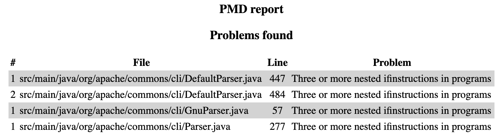
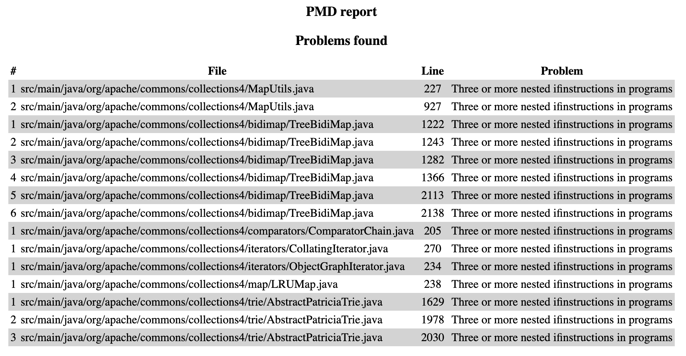

# Extending PMD

Use XPath to define a new rule for PMD to prevent complex code. The rule should detect the use of three or more nested `if` statements in Java programs so it can detect patterns like the following:

```Java
if (...) {
    ...
    if (...) {
        ...
        if (...) {
            ....
        }
    }

}
```
Notice that the nested `if`s may not be direct children of the outer `if`s. They may be written, for example, inside a `for` loop or any other statement.
Write below the XML definition of your rule.

You can find more information on extending PMD in the following link: https://pmd.github.io/latest/pmd_userdocs_extending_writing_rules_intro.html, as well as help for using `pmd-designer` [here](https://github.com/selabs-ur1/VV-ISTIC-TP2/blob/master/exercises/designer-help.md).

Use your rule with different projects and describe you findings below. See the [instructions](../sujet.md) for suggestions on the projects to use.

## Answer

Voici la règle que nous avons créée et qui permet de détecter les blocs de code contenant trois ou plus `if` imbriqués sans autre instruction entre eux:

```xml
<ruleset name="Custom Ruleset"
         xmlns="http://pmd.sourceforge.net/ruleset/2.0.0"
         xmlns:xsi="http://www.w3.org/2001/XMLSchema-instance"
         xsi:schemaLocation="http://pmd.sourceforge.net/ruleset/2.0.0
                             http://pmd.github.io/pmd-6.0.0/ruleset_2_0_0.xsd">

    <description>
        Custom ruleset to detect exactly three directly nested 'if' statements in Java programs.
    </description>

    <rule name="ifAncestor"
      language="java"
      message="Three or more nested ifinstructions in programs"
      class="net.sourceforge.pmd.lang.rule.xpath.XPathRule">
      <description>
        This rule detects whether there are three or more nested
        ifinstructions in programs.
      </description>
      <priority>3</priority>
      <properties>
        <property name="xpath">
           <value>
                <![CDATA[
                //IfStatement[
                    Block/IfStatement[
                        Block/IfStatement      
                    ]
                ]
                ]]>
           </value>
        </property>
      </properties>
    </rule>

</ruleset>
```

Nous avons utilisé cette règle sur le projet 'Apache Commons CLI' et nous avons obtenu les résultats suivants:



Comme nous pouvons le constater il y a trois problèmes qui sont détectés à l'aide de la règle que nous venons d'ajouter, voici le code de l'une d'entre elles:

```java
if (!cmd.hasOption(option) && !selected) {
                // get the value from the properties
                final String value = properties.getProperty(option);

                if (opt.hasArg()) {
                    if (Util.isEmpty(opt.getValues())) {
                        opt.processValue(stripLeadingAndTrailingQuotesDefaultOff(value));
                    }
                } else if (!("yes".equalsIgnoreCase(value) || "true".equalsIgnoreCase(value) || "1".equalsIgnoreCase(value))) {
                    // if the value is not yes, true or 1 then don't add the option to the CommandLine
                    continue;
                }
                handleOption(opt);
                currentOption = null;
            }
```

La règle semble bien fonctionnner car elle a détecté une imbrication de trois `if` dans le code.

Nous avons également utilisé cette règle sur le projet 'Apache Commons Collections' et nous avons obtenu les résultats suivants:



```java
if (map != null) {
            final Object answer = map.get(key);
            if (answer != null) {
                if (answer instanceof Boolean) {
                    return (Boolean) answer;
                }
                if (answer instanceof String) {
                    return Boolean.valueOf((String) answer);
                }
                if (answer instanceof Number) {
                    final Number n = (Number) answer;
                    return n.intValue() != 0 ? Boolean.TRUE : Boolean.FALSE;
                }
            }
        }
```