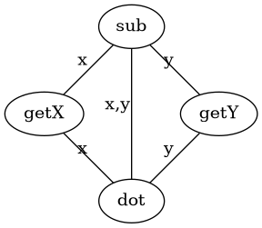
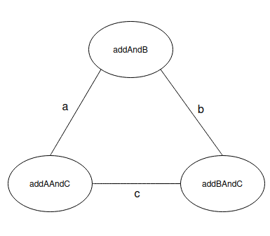

# TCC *vs* LCC

Explain under which circumstances *Tight Class Cohesion* (TCC) and *Loose Class Cohesion* (LCC) metrics produce the same value for a given Java class. Build an example of such a class and include the code below or find one example in an open-source project from Github and include the link to the class below. Could LCC be lower than TCC for any given class? Explain.

A refresher on TCC and LCC is available in the [course notes](https://oscarlvp.github.io/vandv-classes/#cohesion-graph).

## Answer

TCC et LCC donnent la même valeur pour une classe java lorsque toutes les pairs de méthodes qui accèdent à au moint un attribut sont directement connectés par des attributs communs (partage un attribut). C'est à dire qu'il n'y a pas de connexion indirects supplémentaires.

Par exemple ci-dessus on TCC = 5/6 (car getX n'est pas lié à getY) et LCC = 1;
Il suffirait d'avoir une liaison entre getX et getY pour que TCC = LCC = 1.

La classe Java 
[ExempleTccLcc](../ExempleTccLcc.java) donne un exemple dans lequel toutes les connexions sont directs. 

On peut imaginer d'autre cas ou TCC = LCC = 0 par exemple. Pour il suffit que aucune méthode ne soit liée (ni directement, ni indirectement).

LCC >= TCC on ne peut pas avoir l'inverse car le nombre de pairs de méthode directement liées est inclus dans le nombre de pairs de méthodes directement et indirectement liées. 
